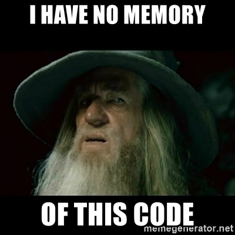

```{r setup, include=FALSE}
knitr::opts_chunk$set(echo = TRUE)
```


Today we'll start by familiarizing ourselves with the RStudio Graphical User Interface (GUI) and basic R commands and operators. We'll also examine Git version control and R Markdown for making "pretty" documents.

## Objectives 
- Learn how to use these tutorials. 
- Learn how to navigate and customize the RStudio GUI.
- Learn how to install and use packages in R.
- Learn how to find help within R.
- Familiarize yourself with the R Markdown structure and .git version control.
- Learn how to import data, create data, explore its structure, and perform basic operations.


## Acknowledgments 

I am a strong believer in open code, open access, open resources, and not reinventing the wheel. That being said, while I attribute sources within this document, I'd like to acknowledge upfront those whose hard work I have shamelessly drawn from or used as reference.

- Jonathan Gilligan's [Global Climate Change course materials](https://github.com/gilligan-ees-3310-2020)
- [YaRrr! The Pirate's Guide to R](https://bookdown.org/ndphillips/YaRrr/basics.html)
- [The R Book: Chapter 1](https://learning.oreilly.com/library/view/the-r-book/9780470510247/05_chapter-01.html#ch1)
- [Cookbook for R](http://www.cookbook-r.com/Basics/Information_about_variables/)


## How to use the tutorials {.tabset}

These tutorials are intended to provide you with some background information on topics and outline some tasks to be undertaken in R. These are a supplement to, not a replacement for, the reading. 

While I will not collect R scripts or other documents from you demonstrating that you have completed the tutorials, I do expect you to work through the tutorials in R.

<center>*If the text says to try running a piece of code then you should probably do it. If I ask a question you should probably seriously consider what an answer might be, and perhaps even write it down.*</center>

Why do I expect this? Because no one learned how to write code or use a piece of software by just reading about it. **This is one of those things you must do to learn.** 

I also expect you to work through the tutorials **before** the next class period. Even if you are just copying worked through examples you are bound to run into problems at some point. It's better that we identify those problems and fix them before we start adding on to the complexity.

Each tutorial will have several tabs. You should work through the tabs going from left to right.


***

### Getting Started with RStudio 

- Let's start off by opening up RStudio and setting up the Graphical User Interface (GUI). (A written guide to much of this information can be found in [The R Book: Chapter 1](https://learning.oreilly.com/library/view/the-r-book/9780470510247/05_chapter-01.html#ch1). Note that some of the information in this source is outdated.)
  - Go ahead and check out this source. You can sign in for free using your university email address.

- If you would like to change the display settings go to Tools --> Global Options --> Appearance and choose a new "Editor Theme".  (My personal preference is "cobalt".)


- Now lets check out the version and citation information for R.

 Type the following into the command console window (lower left) to the right of the `>`
 
 Hit enter after each command.
 

```{r version, results='hide'}

R.Version()

citation()

```


***

Note: In R `( )` immediately following a word indicate that we are working with a function. The parentheses hold the arguments that must be answered in order for a function to run. For example: if we wanted to calculate the mean value of a vector of values we would need to provide, at the very least, that vector of values to the function that calculates the mean. In some cases, such as those run above, no arguments need to be supplied. In these cases, R will refer to some pre-established default. In these tutorials I will use `this font` to denote functions, oeprators, and code within the text.


### Packages 


If you have played around with R a little you may be wondering what *packages* are and why there are so many of them. 

</br>
<center></center>
</br>


Simply put packages are user-developed collections of tools and functions that work in the R environment. These packages are what make R so powerful, but at times so frustrating. As tools developed by R users for R users many of the packages focus on simplifying the use of R for specific applied science and data analysis tasks. (**REALLY HELPFUL!**) This means that your average R user, like you and me, can focus on the science instead of worrying about the nitty gritty details of the mathematics and programming behind the methods. 

However, this also means that each package has its own unique syntax, function names and argument calls, user support documentation, update timing (and sometimes no updates), and occasionally even data classes. (**REALLY FRUSTRATING!**) And because there are so many packages it is unrealistic to expect to become an expert in them all. Most R users frequently reference the R help and other online forums when they can't remember the name of a specific function, or how to structure an expression, etc.... 

Don't worry. Once you learn how to: find packages that can help you solve your problems, read the documentation, navigate the forums and search for help you'll find that there are very few data problems that can't be tackled in R.

***

- While R comes with plenty of base functions (you don't need to install a package to use them) and a few standard packages most packages will need to be manually installed onto your computer.

To install a package simply type `install.packages("name of package")` in the command line. 

- To actually make use of an installed package during an active R session you need to load the information (functions, help documents, etc...) contained in the package.

To load the package type `library(package name)` in the command line.

- Occasionally you may need to update your packages. (Some packages are interdependent and changes in one may necessitate an update of the other in order to avoid errors.)

Simply type `update.packages()` in the command line to update all packages.


Try the following:

```{r packages, eval=FALSE}

install.packages("sf") #sf is a fantastic package for handling spatial data that we will use often later in the semester

library(sf)


update.packages()

# P.S. Text following the "#" sign is designated as a comment and is not treated or run like code.
# Note that in the cobalt user interface comments are also a different color and appear in italics.
# Comments are this researchers best friend as they allow me to understand what I did when I come back to a script after a few days or weeks or ...
# They are also helpful for explaining your logic/process for others that you share your code with.
# Main point: comment often, comment well

```

<center></center>


**NOTE:** If you want to run another install packages command for a different package (e.g. ggplot2) you can simply hit the **up arrow** to pull up a previous command on the current command line. You can then edit the name of the package and hit enter to run the command as normal. Becuase of this rather convenient feature you should NOT attempt to use the arrow keys to navigate through the command console output (say you had R return a long list and you want to go back and take a look at it). Instead use the scroll bar.

</br>


### Getting Help 

Now lets check out a few ways to access R help. While it is normal to conduct web searches to assist with writing code to solve complex problems in many cases (e.g. wrong syntax used, can't remember specific function arguments that need to be referenced) a simple review of the official R Documentation can help you pinpoint and correct the issue.

To access the R Documentation on how to use a function we can use the following:

- If you know the name of the function you need help with type a `?` followed by the function name 
- If you don't remember the exact function name but know the topic use `??` followed by the topic or `help.search("topic")`


Try the following one at a time.

```{r help, eval=FALSE}

?read.csv

?hist

??csv

??histogram


```

Notice the small window in the lower right-hand corner of your screen? Here we can see the Help documentation related to these functions/topics.

Remember the function name but can't remember what the arguments to that function are or how they are structured/ordered? In the command console simply start typing in the function name and hover your mouse over the little pop-up window for the function you want, or put in the parentheses after the function name and check out the little yellow pop-up window before you continue typing any arguments. 

I personally find the auto-suggestion, auto-fill, and function argument pop-up window to be the most useful parts of the R Studio interface and use them every time I work in R.


***

Of course there are numerous online sources of R help as well. Let's start with the more *official* sources of online help.

- CRAN stands for *The Comprehensive R Archive Network* and contains complete package doucmentation including: package reference manuals, package websites, and package vignettes. 
  - Package reference manuals are essentially a compilation of the official R Documentation for all functions in a package.
  - Package websites will often provide a nice html formatted version of the R documenation, perhaps with more worked examples, and/or provide access to the code that makes up the package itself.
  - Package vignettes are wonderful walkthrough tutorials that provide a more thorough examination of how a package and its functions can be used. Of course, these are produced by the package creators so they come in different flavors and some are more useful than others.
  
**Note**: I'm cheating a bit here by saying this is online help. While you will typically access this info online, for packages you have installed most of this information should actually exist in your R library on your computer.

- Let's go to the [CRAN website](https://cran.r-project.org/).
- On the left, click on **Packages** and scroll down to **dplyr**

You should now see a page that provides: the name of the package along with a brief description, information on the latest version and when it was published, the authors of the package, the website, a link to the reference manual, and links to a set of vignettes amoung other things.

- Take a quick look at the reference manual. In some cases this is the best place to go to try to understand what a function is doing.
- Now take a look at the **Introduction to dplyr** vignette. See how these might be really useful?

If you are looking for a package that does a specific thing (e.g. multilevel modeling) and easy way to find one is to search CRAN (using the search menu accessible from the CRAN homepage) by that topic.


- For more tutorials and worked examples from the R community check [R-bloggers](https://www.r-bloggers.com/).
- For help with various technical coding challenges I reccomend [StackExchange](https://stackexchange.com/).

There are also numerous google groups dedicated to specific R packages and google searches are generally fruitful provided you specify that you are searching for an answer to an R problem, provide plenty of detail, and try out different search terms.

</br>

### R Scripts, R Projects, and R Markdown 


Thus far we have used only the R command console to do calculations and assign data. However, if we want to be able to go back and reproduce a set of calculations or want to share our code with others we will want a way to save and store and modify the R commands and operations we run. The simplest way to do this is using an **R script**. An R script is simply a text document (with a .R file ending) in which we write out all the R commands we want to run and descriptive comments about these commands. In R Studio we can then select and run commands  from the script.

- Create a new R script by going to File --> New File --> R Script
- In this new R script which should pull up in the Source window (upper left) in R Studio type up all the R commands we have run thus far and then save the script to a folder named "Lab 1".
- Try running the first line of code by placing your cursor next to it then typing **cntrl + enter** or using the **Run** menu in the upper right corner of the script window (Run Selected Line).
- OK, now try running all the lines of code by highlighting all lines of code then typing **cntrl + enter** or using the **Run** menu.

Easy peasy, right?


****


**OK, so what is an *R Project*?**

An R Project is essentially a special R folder that holds your R materials related to a specific topic. Technically, it a ***working directory****, a file path on your computer that maps where information should be coming from and going to that is desgnated with a .RProj file. In R you work out of a single active working directory at a time. So if we want to pull data files from other folders on our computer we have to specify the full path (e.g.*"C:/Users/jane/Documents/GEOG 728/mydata.csv"*) instead of just writing out the file name "mydata.csv". I'll show you how to check and set your working directory next week, but for simply know that using a project simplifies things a bit by streamlining and automating the working directory references in R. 

Your R Projects can hold R Scripts, R Markdown files, data, text files, images, etc... and you can easily organize these items in an R Project by creating sub folders.

- Let's try creating a new R Project by going to File --> New File --> R Project --> Existing Directory --> Navigate to your "Lab 1" folder and assign the R Project there
- In this new R Project you should see a list of Files in the window in the lower right. Click on your script to pull it up in the main Source window.


*****

**Now the final, and perhaps most terrifying, R file type. R Markdown!**
* Much of this section comes from Jonathan Gilligan's great R Markdown Intro which can be found [here](https://github.com/gilligan-ees-3310-2020/lab-01-documentation).

R Markdown is a fantastic tool that allows us to combine text and chunks of R code and their output into a single document.  These documents are stored as .Rmd files and use a plain text formatting system called **Markdown** to create pretty documents that can be converted to HTML documents or web pages, PDFs, or even MS Word documents. The big advantage here is that we can produce not just cool looking documents, but we can also integrate instructions or background information with our actual analysis and results. Making it easier for others to understand what we did, how we did it, and what we found.

Why did I say it can be terrifying? Am I just being overly dramatic?

Well, yes, but also because R Markdown files can be somewhat intimidating when you first start working with them as you have to handle both Markdown text formatting and R code as well as the various organizational and formatting rules for integrating the two. But don't let that worry you too much, we'll start simple and there are plenty of resources out there for those of you who want to get real fancy.

As proof that it's not so terrifying after all, this tutorial was made using R Markdown. Later on I'll show you where you can download the .Rmd version to use as a template for your own work if you so desire.

- Let's create a new R Markdown file in our R Project by going to File --> New File --> R Markdown --> Choose a Document --> Set the title as "My First Markdown" --> Select html as the default format

At the top of your new .Rmd you should see something like the following.

```
---
title: "My First Markdown"
author: "Kate Nelson"
date: "1/9/2020"
output: html_document
---
```

This is the document header information. All the information here, except for the output setting will be printed at the top of the final document you create from this file. To turn an RMarkdown document into an HTML, PDF, or Microsoft Word document, you just click on the "Knit" button in RStudio. If you click on the word "Knit" on the 
button, RStudio will turn the RMarkdown document into the default format specified in the header information under **output:**. To knit the document into a different output format, click on the arrow just to the right of the word "Knit," and select the output format you want.

Just below the header information you will see an R code chunk called **R setup**. Code chunks can be distinguished by the **```** at the beginning and end of the chunk. Code chunks also have a slightly different background color as text. This code chunk holds information about how we want to run and process R code in the .Rmd. So we could load package libraries here, etc... 

- For now leave this alone and go down to the text section below.

Any line of text that begins with one or more hash symbols ("#") and is preceded by 
a blank line is treated as a section header. (In code chunks the "#" character still denotes a comment.) Top-level section headers have a single
hash, and subsections, subsubsections, etc. use two, three, etc. hashes.


```
# This is a top-level section header

## This is a subsection

### This is a subsubsection

# This is another section
```

- Try changing the existing heading to "This is what my first R markdown looks like" or some such thing.


Any block of one or more lines of text, with a blank line before and a blank line after is treated as a single paragraph.  To separate paragraphs, put a blank line between them:

```
This is one paragraph.
It stretches over several consecutive lines,
but it will be formatted 
as a single paragraph.

This is another paragraph.
The blank line between the two
blocks of text tells Markdown
that they are separate paragraphs
```

- Try adding some text describing what you did in your starter script that we created earlier. Make sure you create at least two paragraphs.


To make _italic text_ and **boldface text** you surround the text with underscores 
or asterisks. A single underscore or asterisk means italic, two means boldface, 
and three means both italic and boldface:

```
This is _italic text_. This is *also italic text*. __This is boldface__ and 
**so is this**. ***This is bold italic***. This is ~~strikethrough~~, perhaps 
to indicate an error.
```

- Try formatting some of your newly written text as italic or bold or both.


You can make bulleted or numbered lists easily in Markdown. Simply begin a line 
with an asterisk, hyphen, or plus sign. Numbered lists can be made by using a 
number followed by a period.To make a sub-list, just indent the lines of the 
sublist by four spaces.

```
* This is a list

* This is the second item of the list.

    * This is a sub-list
    
        A list item can have several paragraphs. Just ident the continuation 
        by four additional spaces and do not begin it with an asterisk.
        If you have multiple lines with no blank line separating them,
        Markdown treats them as a single paragraph.

* This is the main list again.
  Just as with other things, you can break a single list item into several lines,
  and as long as there is no blank line between them, Markdown knows to treat
  them as a single paragraph.
```

- Try creating a list of your favorite things (eg. rain drops on roses and whiskers on kittens).

As I said before, one of the best reasons to use R Markdown documents is because we can integrate text with R computation. To enter R expressions in an RMarkdown document, we use "code blocks" or "inline code". Code blocks are useful if we are doing a calculation, and inline code is useful if you just want to insert a number (maybe one you have calculated in a code block) into the middle of a line of text.

Code blocks begin and end with three consecutive "back-tick" characters:

<pre><code>```{r code_block_name, options}
   # code goes here, for example
   1+1
 <pre><code>```</code></pre></code></pre>


Each code chunk needs to have a unique name and we can specify options that will: show or hide the code, show or hide the results, evaluate the code or not, etc...


We can assign numbers to variables and do computations in a code chunk much as we would do in an R Script. If we ask the R code to return an object it will be printed immediately below the code chunk as seen below.

```{r stefan_boltzmann}
sigma <- 5.67E-8
I_solar <- 1350 # watts per square meter
albedo <- 0.3
I_absorbed <- I_solar * (1 - albedo)
T <- (I_absorbed / (4 * sigma))^0.25
T
```

Code blocks can also be used to include tables and graphs in our document.


Inline code appears between single back-ticks `` `r
1+1` `` 
Just as a code chunk start by specifying that `R` language should be applied by writing the character "r" in the chunk header information, inline code starts by specifying "r" then what should be run using that `R`.

We can use inline code to print the value of an R expression in the middle of a line of text. For example 
using inline code ``  T =  `r knitr::inline_expr("T")`  `` will give T = `r T`. Or we could write ``  T =  `r knitr::inline_expr("(I_absorbed / (4 * sigma))^0.25")`  `` to return `r (I_absorbed / (4 * sigma))^0.25`.

Inline code is very useful because it lets us ask R to automatically insert a 
number into the text. This means that every time we knit the document, that number 
is generated by R. If you write a report and then realize that there was a problem 
with the data or the analysis, you can just fix the problem and re-knit the report 
using the corrected data and analysis code. You don't need to manually go through 
a separate document and edit the numbers to update them with the latest results 
from your analysis. RMarkdown will do that for you, if you used inline code to 
insert the numbers into your text.

Thus, a bit of extra work at the beginning to set up the document and analysis 
using RMarkdown saves lots of time later on by making it trivial to update the 
document.


There is MUCH MUCH more that can be done with Markdown formatting including adding images and hyperlinks or even tabs (like in this tutorial)  that you can explore on your own using the following references:

- [Jonathan Gilligan's R Markdown Intro](https://github.com/gilligan-ees-3310-2020/lab-01-documentation)
- [The R Markdown Cheatsheet](https://rstudio.com/wp-content/uploads/2019/01/Cheatsheets_2019.pdf) (This can also be found under the Help menu.)
- [R Markdown the Definitive Guide](https://bookdown.org/yihui/rmarkdown/html-document.html#tabbed-sections)

You can also pull up the Markdown Quick Reference guide in the help window of the R Studio GUI. Go to Help --> Markdown Quick Reference 

For now let's wrap up by trying to actually convert our markdown file into an html file.

- Click the **Knit** button at the top of the main window.

A html version of your .Rmd should have popped up in a second window. How does it look?


### Version Control

Full Disclosure *Much of this section comes from Jonathan Gilligan's introduction to Reproducible Research which can be found [here](https://github.com/gilligan-ees-3310-2020/lab-01-documentation).

  As you edit both your text and the R scripts you use for
  your analysis,  it is valuable to be able to keep track of changes. For
  instance, if your analysis is working well, and then you edit something and it
  stops working it is useful to be able to go back and look at what changed
  between the time when it was working and when it stopped working.
    
  Version (or revision) control systems allow you to easily keep track of changes you make
  to your files, and it is increasingly becoming a standard practice to use version control in data analytics
  and computationally intensive research.
    
  We will be using a revision control tool called `git`. Not only can we use GIT version control in R via our R Projects, but there is a web site
  called [github.com](https://github.com), which allows people to store their version controlled projects in the cloud and serves as a platform for 
  sharing of and collaboration on projects.  I personally use github to release scripts and models developed
  in my research, and there is an educational site connected to github, which we will use for some class assignments later in the semester.
  
  For now though, we will start by using local version control through R.
  
  - Let's enable GIT version control on our R project by going to Tools --> Project Options--> GIT/SVN and enable GIT
  
  You should now have in the upper-right window a tab that says **Git**. This window will show you a list of all the files in your R PRoject that have been modified. If we click   on the **Commit** button we should be able to see what has been changed in each document as well as a history of these changes. Right now you won't see anything becuase you haven't changed any files in your R Project since we enabled version control.
  
  - Add another paragraph of random text to your R Markdown file and save it. Then click the **Commit** button.
  
If you examine your markdown file in the commit window you should now see some text in the preview that is highlighted in <span style="color:green">**green**</span>. The git version control is telling us that the only change made was to add this text. (Deletions are shown in <span style="color:red">**red**</span>.) If we think that this is a good and significant change to keep we should type a commit message like "added some random text" and click the "Commit" button. This will ask git to remember what the document looked like at this exact moment in our revisions. Say I changed a code chunk and somehow break everything. Instead of trying to remember exactly what it looked like before I messed it up I could just go back to the **History** section in the git commit window and restore that earlier version of my document. Of course, this means that I actually need to **commit** my changes frequently (not just save the document).

- Go ahead and commit your changes to your .Rmd


***

### Getting Started with Data in R 

Whew, that was a lot of information. Finally, we're ready to get cooking with some data. But wait! First we need to get some data into R. 

- To keep things simple let's start by just making a few variables to work with. Type the following code in your **Lab 1** R Script, then select the lines of code you want to run and hit **cntrl+Enter**.


```{r data}

x <- 6
y <- 8
n <- 1:10
let <- mtcarsS[1:10]
z <- c(1, 1, 2, 3, 5, NA, 13)
let_df <- data.frame(n, let)


# I'm pulling heavily from http://www.cookbook-r.com/Basics/Information_about_variables/ for this

```

So what did we just do? We just created new numerical data objects called "x" and "y" with a value of 6 and 8, a new vector data object called "n" with integer values 1 through 10, a new vector called "let" that includes the first 10 letters of the alphabet, a list called "z" that includes some numbers and a *NULL* or missing data value, and a data frame that combines the two vectors "n" and "let".

**Some Important Notes**

-  `<-` is an operator that assigns a value, vector, dataframe, etc... to the thing that is pointed to
  
-  `:` is an operator that identifies a sequence. It can be used to create a new sequence or to reference a sequence of values or columns, etc... within an existing dataset.
  
-  `LETTERS` is a set of constants built into base R, namely the 26 letters of the alphabet in upper-case. Check ?Constants for other constants available.

Let's check to make sure these variables really are what we think they are by asking R to return their values.

```{r data2}

x 
y 
n
let 
z 
let_df

```

So far so good. Now let's perform some basic operations on these variables.

- We can do very simple stuff, like say adding x + y. (Incidentally we could just type 6+8 in our R console to get this answer. It's not always neccessary to assign all values to a data object.)
- We can evaluate logical expressions, like is y > 2
- We can also run some basic functions on these to do things like calculate the log of x.
- We can also perform operations on a vector like multiplying all values in n by 2.
- Or we could calculate the mean of n, or the maximum of let (remember this is a vector of text characters so we should not attempt to compute the mean), or the sum of z.


```{r data3}

x + y 

y > 2

6 + 8

log(6)

n*2

max(let)

sum(z)

sum(z, na.rm=T)


```

Great! Notice that null values will throw off most calculations (and most real datasets have nulls) so we need to specify what to do with them in the function if we want a value returned. Often we choose to remove or ignore nulls using `na.rm=TRUE`, but this is not always the appropriate choice.


- Did you notice if the log function calculates the natural logarithm or the base 10 log? 
- What would you add to the code above if you wanted to retain one of these answers for later use?
- What should the missing value in z be?


***
### Even More Data in R

Now on to bigger and better things... lets try one of the most basic and important tasks in R: **importing data**. Yay!

R is wonderfully flexible with the types of data you can import and work with. Got a csv or text file? Base R can handle that. What about an excel file or shapefile? 

<center>**There's a package for that!**</center>
</br>


- Let's start by loading a csv using the `read.csv` function. Download the file ***iris.csv*** from Canvas into your R project folder then try loading it into R. Remember that you can use `?read.csv` to get help on how to use this function.


```{r csv, results='hide', echo=FALSE}

read.csv("iris.csv", stringsAsFactors = FALSE)


```

You should now see a table of information from the iris dataset printed out on your console. In this case R has read the data and shown us what it found, but becuase we have not assigned it to a data object it was not retained in the R working environment. Let's try again, this time assign the dataset to a data object using the `<-` operator.


```{r csv2, results='hide'}

d<-read.csv("iris.csv", stringsAsFactors = FALSE)


```


OK. Now let's see what we can find out about this dataset. Let's take a quick look at the data by simply asking R to return the dataset.

```{r iris}

d


```

Wow! That pretty much filled up your console with a bunch of numbers. Let's try using the `head()` function to get just a summary of the first few records for the dataset.

```{r iris2}

head(d)

head(d, 10)


```


- So what does the `10` in the function `head()` mean?


What if I want to know how many rows or columns (or both) are in a dataset?

- Try the `nrow()`, `ncol()`, and `dim()` functions.

```{r iris3}

nrow(d)

ncol(d)

dim(d)


```

By the way, the `iris` dataset is a [pretty famous dataset in R land](https://twitter.com/kareem_carr/status/1156279166276386816). It's actually one of the datasets provided with base R via the package "datasets()" to allow for simple illustrations of R functions and is widely used for demonstrations and worked examples for many of the more widely used R packages such as dplyr and ggplot2. Want to know how to access these mysterious, freely provided datasets? 

-Just type `data()`

You should now have a second tab open in your main R-Studio window called "R data sets". You can pull any of these datasets into your working environment in R using the command  `data(dataset name)`.

-Try assigning one of these datasets to a new data object called **ds** using the name of the dataset provided in the "R data sets" tab.
- Then take a look at the data, get a summary of the first 5 records, and gather information on its dimensions, number of rows and number of columns.

For example for the `mtcars` dataset I get:

```{r mtcars, echo=FALSE}

ds<-mtcars

ds

head(ds,5)

dim(ds)

nrow(ds)

ncol(ds)


```


