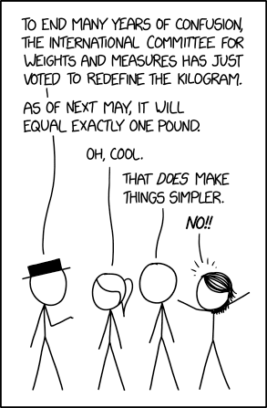

```{r setup, include=FALSE}
knitr::opts_chunk$set(echo = FALSE)
```

## Welcome to GEOG 728

Where we will explore analysis and modeling of geospatial data using the open software **R**!
<center>Exciting!</center>

## About the course

This is a broad overview course, I try to cover use of R from the ground up as well as some basics of data science/analytics, spatial analysis, mapping, and spatial modeling. As such, the information I provide may at times seem a mile wide and an inch deep (or a kilometer wide and a centimeter deep for all ye who reject units that are not from the metric system). 

<center></center>

It is up to you to spend the time to add depth outside of class time using the resources I provide, as well as those you discover yourselves. It is also crucial that you keep up with the reading, tutorials, and lab exercises as the skills you learn will build upon each other.

## Format of the class

This is a studio class, as such you should expect much of our class time to be spent *doing* as opposed to *listening*. 

- I will give brief lectures during class to introduce basic ideas and concepts. 
  - I expect to spend more time (20-30 minutes) lecturing on Tuesdays and less time on Thursdays (5-10 minutes).
- I will occasionally do demonstrations.
- Each class period we will do some live coding together.
- I will frequently provide you with "challenge problems" to push you to independently problem-solve and troubleshoot code.
  - You are encouraged to work with your peers on these problems.
- Each class period we will have open question/discussion time to address any and all coding, R, markdown, git, spatial analysis, data hunting, modeling, etc... questions.
  - This is your chance to get help on anything you are struggling with in the class, or to share a problem that you might have encountered and overcome. There is no such thing as too trivial a question/problem in coding. I guarantee that everyone has made silly mistakes or encountered an inexplicable error when coding. Sharing yours may help others to avoid the same mistake.
  - This is also your opportunity to bring up topics I may not have covered in class or brainstorm analysis ideas or talk data sources with me and your peers.
- Some class periods we may have time for you to start on your lab assignments.

<center>If you feel the balance is off let me know and I'll do my best to adjust.</center>

## Class preparation and assessments

- You will have assigned reading to do before almost every class period. Some of these readings will be on R and use of R. Others will be on topics such as spatial analysis. 
- Each week you will have a tutorial to work through to practice running code in R using pre-tested materials and code.

- You will have a lab assignment to complete nearly every week. These assignments are the majority of your grade for the course.
- You will complete an independent research project that will be due the last week of the course.
- You should contribute at least 5 posts to the class discussion board. You can post a problem, reply to a peer's problem with a solution, or reply to your own problem with a solution. Posts sharing other resources are also welcome. 
- Graduate students only will develop a short tutorial and give a brief lecture to the class on an R package or skill not covered in the course schedule. (I have a list of recommended topics that you are welcome to draw from.)

 

## What I expect

- Treat each other with respect.
- Do the readings before class.
  - Skip the reading at your own peril. My short lectures can not and will not cover this material is as great a depth as the readings will.
- Complete the tutorials before class on the day indicated (usually before Thursday).
  - Skip the tutorials at your own peril. 
- Take the tutorials seriously. 
  - Take time to understand what the code you are given is doing. Just copying and pasting and running the code without really thinking about it has a limited impact on your learning.
- Ask questions and be willing to discuss topics during class.
- Communicate with me (I still haven't worked out the whole mind reading thing).
  


## What you can expect from me

- Timely response to your emails to me about the class (typically 24-48 hrs).
- Timely feedback on assignments (usually 1 week turnaround).
- Availability outside of class (during office hours or by appointment) to discuss projects, coding challenges, etc...


## Welcome to R land!


- R is a free, opensource software environment and *statistical* programming language.
  - While you can do more than statistics in R, statistics (predominately applied statistics) are at the heart and soul of R.
  - You can download R [here](https://www.r-project.org/).
- The capabilities of base R are extended by *user-created* packages that offer new functions, object types, and reporting options.
- R Studio is a GUI (graphical user interface) or Integrated Development Environment (IDE) that is basically a wrapper for all things R.
  - You can download the opensource version of RStudio for Desktop [here](https://www.rstudio.com/products/rstudio/).


## Let's take a peek under the hood


## What is Git?
  
  
- Git is a free, opensource distributed version control system.
  - Or, in plain English, a system for collaborating on projects that tracks changes in files (particularly code) and allows for the merger of code from multiple parties.
  - You can download Git [here](https://git-scm.com/).
- GitHub is a web platform for project development and version control using Git.
  - GitHub offers a desktop GUI for managing projects with Git and syncing them to remote storage on GitHub's web servers which you can download [here](https://desktop.github.com/).
  

## Let's take a gander


## Live coding!!!


Let's crack open RStudio and make sure we all can do some basic stuff...


